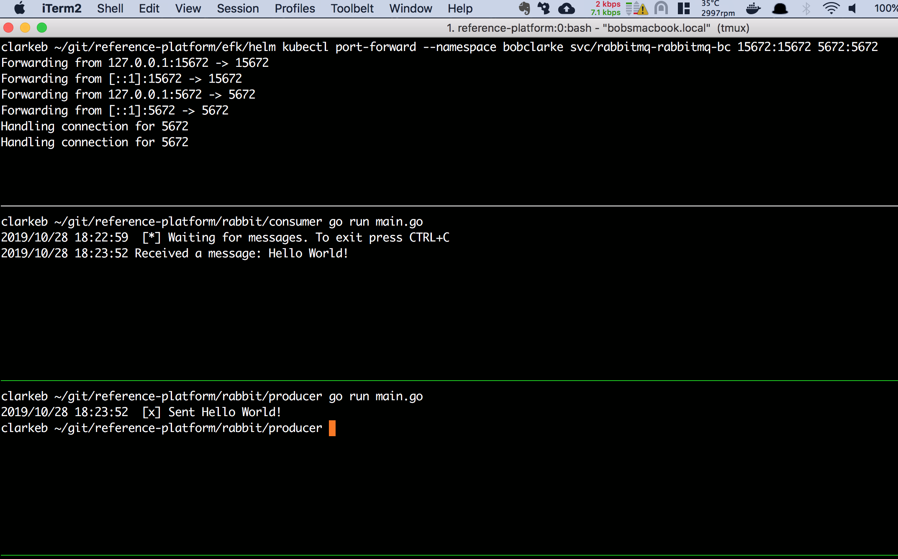
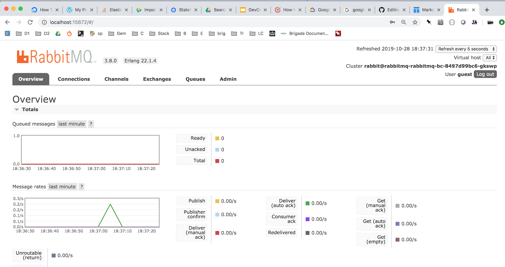

# Reference Platform
### Rabbit MQ 
* Tutorial: https://sysadmincasts.com/episodes/59-fun-with-rabbitmq
* Helm chart: rabbit/helm/rabbitmq-bc
* Testing:
  * open a new terminal window and run ```kubectl port-forward --namespace bobclarke svc/rabbitmq-rabbitmq-bc 15672:15672 5672:5672```
  * Open a browser and navigater to localhost:15672
  * login as guest/guest
  * open a new terminal window, cd to rabbit/consumer and run ```go run main.go```
  * open a new terminal window, cd to rabbit/producer and run ```go run main.go```
  
| ||
|---|---|

### EFK Stack 
* Tutorial: https://www.digitalocean.com/community/tutorials/how-to-set-up-an-elasticsearch-fluentd-and-kibana-efk-logging-stack-on-kubernetes
* Helm chart: efk/helm/efk-bc
* Testing Elasticsearch:
  * Hint: after installing the helm chart run ```kubectl rollout status sts/es-cluster``` as an alternative to ```kubectl get pods -n bobclarke```
  * kubectl port-forward es-cluster-0 9200:9200 -n bobclarke
  * curl http://localhost:9200/_cluster/state?pretty


